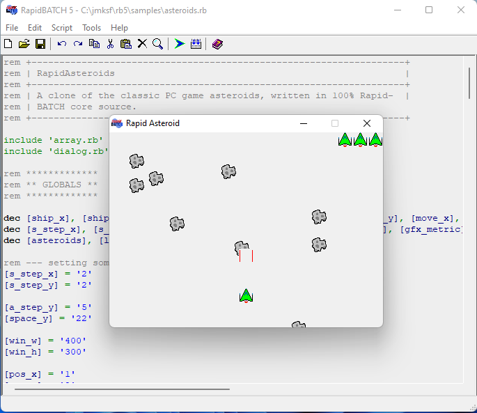
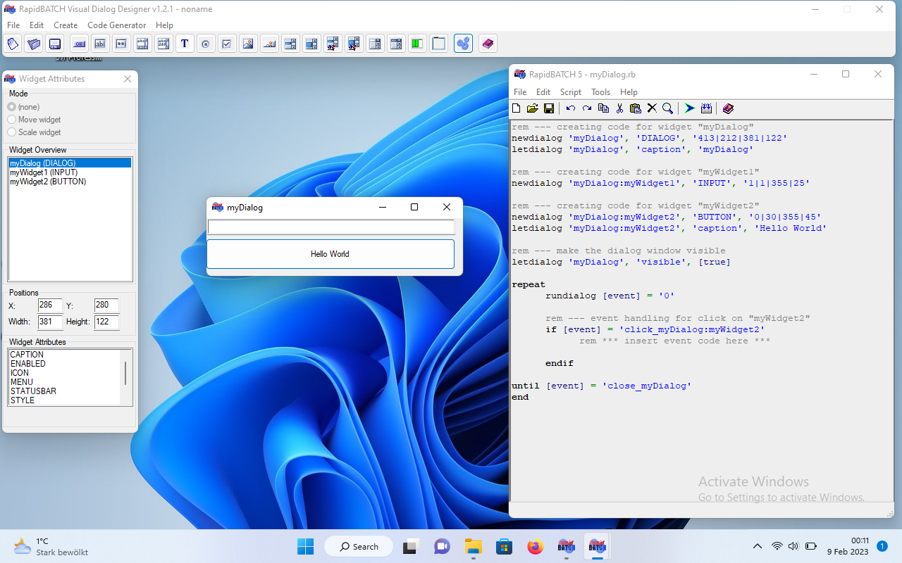

# RapidBATCH 5

This folder contains any RapidBATCH 5 stuff available.

RapidBATCH 5 still runs on Windows 11 ;-)

## deploy

Latest deployed versions of

- RapidBATCH 5.1 Professional Edition
- RapidBATCH 5.2 Beta1

## docs

Rendered documentation from the released version.

It was generated by the documentation generator located in `src/udms`, which itself is written in RapidBATCH.

## samples

The examples scripts with assets contained in the released version.

## src

Contains the entire source code, documentation and setup of RapidBATCH 5.2.

To prevent the source code from getting lost or gathering dust in some private backups, it is here in its unchanged state from 2007.

As no version control tool was used, this is the last available state with partly unpublished changes, as RapidBATCH 5.2 was under development, but never released. It is not maintained and may be incomplete.

This version of RapidBATCH was originally compiled using Borland C++ Builder 4,
but it also was possible to use Borland C++ Compiler 5.5.

Have fun!

